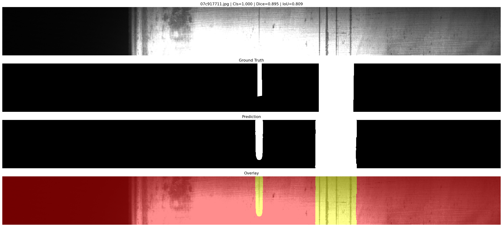

# Multi-Stage Steel Defect Detection

This project implements a multi-stage pipeline for steel surface defect detection using PyTorch. It includes a binary classifier, a full-image FPN segmentation model, and an ROI-based refinement model. The notebook contains the full training and evaluation workflow.

The project is based on the Severstal steel defect detection dataset. Dataset files and model checkpoints are not included in this repository.

## Features

- Binary classifier for defect presence detection
- Full-image FPN segmentation
- ROI-based crop refinement
- Transfer learning with a pretrained ResNet34 encoder
- Test-time augmentation during inference
- Threshold search on the validation set
- Connected component filtering
- Basic morphological post-processing
- Saved metrics, logs, summaries, and example prediction images

## Pipeline

The pipeline has three main stages:

| Stage | Model | Description |
| --- | --- | --- |
| 1 | Binary classifier | Checks whether an image contains a defect. |
| 2 | Full-image FPN segmentation | Predicts a coarse defect mask using the full image. |
| 3 | ROI-based crop refinement | Refines the predicted region using a cropped ROI. |

The final mask combines the full-image prediction and the crop-refined prediction. Small connected components are filtered before evaluation.

## Results

| Metric | Validation | Test |
| --- | ---: | ---: |
| Dice | 80.17% | 79.92% |
| IoU | 73.04% | 72.82% |

Average test inference time:

```text
330.19 ms/image
```

## Example Prediction

Example prediction images are saved in `outputs_improved_strongest/visuals/`.



## Technologies

- Python
- PyTorch
- Segmentation Models PyTorch
- OpenCV
- Albumentations
- NumPy
- Pandas
- Scikit-learn
- Jupyter Notebook

## Repository Structure

```text
.
├── LICENSE
├── README.md
├── requirements.txt
├── multi_stage_steel_defect_detection.ipynb
└── outputs_improved_strongest/
    ├── README.md
    ├── final_project_summary.txt
    ├── final_project_summary.json
    ├── *_metrics.json
    ├── *_history.csv
    ├── *_summary.json
    ├── *_per_image_results.csv
    ├── threshold_search.csv
    └── visuals/
        └── *_prediction.png
```

## Setup

Install the dependencies:

```bash
pip install -r requirements.txt
```

Download the Severstal dataset and place it at:

```text
~/Downloads/severstal-steel-defect-detection
```

If your dataset is stored somewhere else, set the path before running the notebook:

```bash
export SEVERSTAL_BASE_PATH="/path/to/severstal-steel-defect-detection"
```

Open and run:

```text
multi_stage_steel_defect_detection.ipynb
```

## Saved Results

For a quick review without training, open:

```text
outputs_improved_strongest/final_project_summary.txt
```

The notebook also has two quick review cells near the top:

1. `Quick saved-summary view`
2. `Quick saved-visuals view`

These cells print the saved summary and display saved prediction images.

## Checkpoints

Model checkpoint files are ignored by Git because they are large:

```text
outputs_improved_strongest/checkpoints/
```

If the trained checkpoints are available in that folder, the notebook can load them and skip training. If checkpoints are missing, the notebook will train the missing stages.

## Future Work

- Add a small inference script outside the notebook.
- Move reusable code into Python modules.
- Add tests for mask decoding and post-processing.
- Share trained checkpoints through a release or external storage.

## License

This project is licensed under the MIT License. See `LICENSE` for details.
